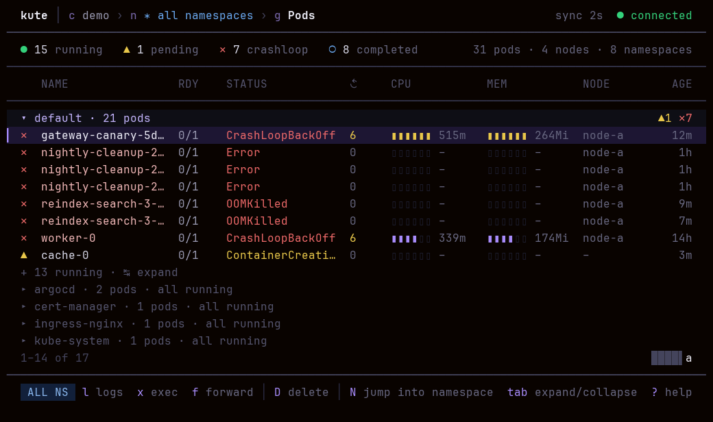
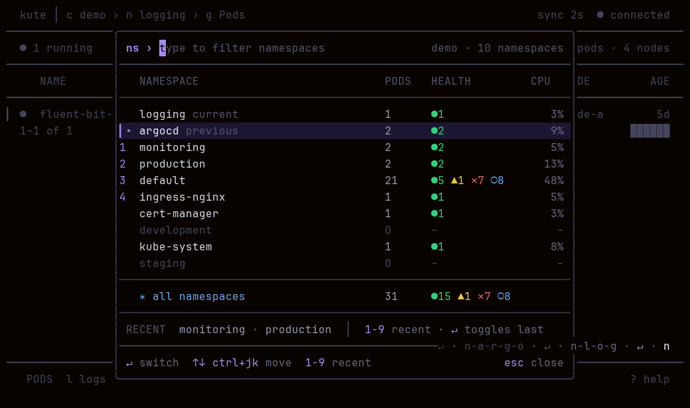
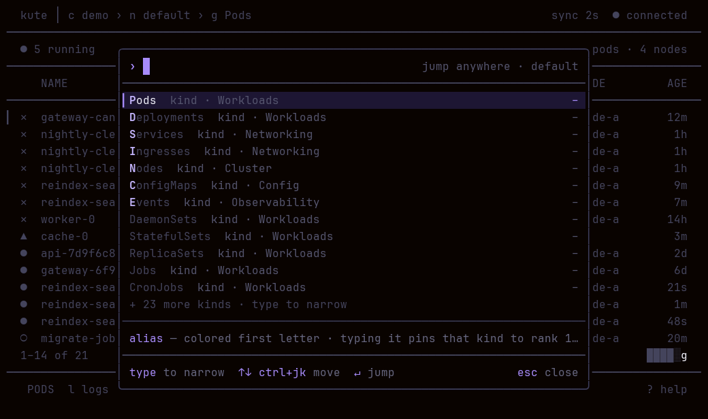

# kute

**Modern Kubernetes TUI**

[kute.dev](https://kute.dev)

### The incident console for Kubernetes.

See what broke. Understand why. Act safely.

Browse, diagnose, and act on your cluster — all from one terminal console. kute is a keyboard-driven Kubernetes console built with [Bubble Tea](https://github.com/charmbracelet/bubbletea) and [Lip Gloss](https://github.com/charmbracelet/lipgloss), designed around the first 15 minutes of an incident rather than plain object browsing.

[](https://kute.dev/guide.html#investigating)

*One frame from an incident walkthrough: a clean production namespace, then all-namespaces surfaces a CrashLoopBackOff pod, logs show the cause, delete asks for explicit confirmation, and the timeline ties the crash to a rollout ten minutes earlier. [Watch it play](https://kute.dev/guide.html#investigating), or run it yourself with `--demo` below.*

## Try it

```sh
go run ./cmd/kute --demo
```

No cluster or kubeconfig required — `--demo` runs against a built-in in-memory fake cluster so you can explore every screen immediately.

## How is kute different from k9s?

**Answers, not objects.**

k9s is an excellent general-purpose Kubernetes browser. If fast object browsing is your main need, it may already be the right tool.

kute is built for the first 15 minutes after something breaks: unhealthy workloads rise first, termination causes remain visible, logs mark container restarts, and the incident timeline correlates crashes, events, and rollout changes. It still browses and edits resources, but its center of gravity is diagnosis.

## What makes it different

- **Unhealthy-first triage** — every list sorts broken workloads to the top; fully healthy groups collapse to a single line instead of burying the incident in green rows.
- **Restart-aware logs and an incident timeline** — pod logs draw a boundary at every container restart; the timeline screen merges events, restarts, and rollout revisions into one newest-first feed answering "what changed recently."
- **Termination causes and conditions shown verbatim** — the actual condition message is the diagnosis, never paraphrased or summarized away.
- **Batch workloads get their own failure trail** — CronJob detail promotes the controller's own failure reason above retained run history; Jobs open an attempt ledger with every retry's exit code, duration, and node kept together.
- **Routing tables resolve to what's actually answering** — Ingress and Gateway API HTTPRoute show every host and path against the backend that's actually serving it, live endpoint health included.
- **Every mutating action shows its command first** — exec, port-forward, scale, image/resource changes, label edits, rollout restarts, and Helm rollbacks all print the exact command that's about to run before it runs. Copyable documentation, not a black box.
- **Deliberate friction on destructive actions** — reversible verbs like cordon execute immediately; delete and rollout-restart are tiered, with inline y/N confirmation normally and a type-the-name modal when the context is explicitly listed as production in your [config file](#configuration), never guessed from a name. Drain always confirms, and force-delete needs the typed name in a prod context.
- **CRDs, Flux, and Argo CD render with zero configuration** — kinds discovered from the API automatically get columns, status, and detail views (a cert-manager `Certificate → CertificateRequest → Order → Challenge` chain shows the real failure reason at each step); Flux's sources/reconcilers and Argo CD's Applications get their own screens, sync status kept separate from workload health. No plugins, no per-CRD setup.
- **Alt-tab namespace/context switching** — the same palette that jumps to any resource kind also toggles between your last two namespaces or contexts with no typing, and recalls recent ones by number.
- **One palette jumps to anything** — a kind's alias letter, a fuzzy kind name, or a specific resource by name all live in the same `g` palette; typing a pod's name jumps straight to it, switching kind and namespace as a side effect.

<details>
<summary>See it: namespace palette alt-tab + digit recall</summary>

[](https://kute.dev/guide.html#navigation)

*Alt-tabs to ingress-nginx and back to default with no typing, then recalls production and argocd from the RECENT row by their digit. [Watch it play](https://kute.dev/guide.html#navigation).*

</details>

<details>
<summary>See it: goto palette alias switch, alt-tab, and jump-to-pod</summary>

[](https://kute.dev/guide.html#navigation)

*Pins Deployments to rank 1 with the `d` alias, alt-tabs between Pods and Deployments with no typing, then types "cache" to jump straight to the cache-0 pod. [Watch it play](https://kute.dev/guide.html#navigation).*

</details>

## Resilience & safety

When the API server connection drops, kute keeps showing your last known state (desaturated, with an age stamp) instead of blanking the screen — and disables every mutating action until the connection is back, including the ones that hand off to `kubectl`: exec, node shell, and edit.

## Install

One binary. Nothing installed in the cluster.

```sh
curl -fsSL https://kute.dev/install.sh | sh
```

Or with Homebrew:

```sh
brew install kute-dev/tap/kute
```

On Windows, with PowerShell:

```powershell
irm https://kute.dev/install.ps1 | iex
```

Or with Scoop:

```powershell
scoop bucket add kute-dev https://github.com/kute-dev/scoop-bucket
scoop install kute
```

<details>
<summary>Verify the download</summary>

Release archives are signed with a keyless [cosign](https://docs.sigstore.dev/cosign/system_config/installation/) identity bound to the release workflow, ship an SPDX SBOM, and carry a GitHub build provenance attestation. Both installers verify the signature automatically when `cosign` is on your `PATH`, and always verify the checksum.

```sh
VERSION=0.4.0
FILE=kute_${VERSION}_linux_amd64.tar.gz
BASE=https://github.com/kute-dev/kute/releases/download/v${VERSION}
curl -fsSLO "${BASE}/${FILE}"
curl -fsSLO "${BASE}/${FILE}.sigstore.json"

cosign verify-blob \
  --certificate-identity-regexp '^https://github\.com/kute-dev/kute/\.github/workflows/release\.yml@refs/tags/' \
  --certificate-oidc-issuer 'https://token.actions.githubusercontent.com' \
  --bundle "${FILE}.sigstore.json" \
  "${FILE}"
```

Success is `Verified OK`. Needs cosign 3 or newer as written; on 2.x add `--new-bundle-format`. [`docs/verifying-releases.md`](docs/verifying-releases.md) covers provenance (`gh attestation verify`), the SBOM, and what the installers do on a machine without cosign.

</details>

## Usage

Run `kute` with no arguments and it opens on the context you last used, in the namespace you left it in. The flags below pin a starting point instead — useful in a script, an alias, or when reproducing something for a bug report.

| Flag | What it does |
| --- | --- |
| `--context <name>` | Launch against a specific kubeconfig context, instead of the last-used one (or the kubeconfig's `current-context` on a first run). |
| `-n`, `--namespace <name>` | Launch in a specific namespace. Outranks both the remembered namespace and the context's own default. |
| `--namespace-scoped <name>` | Restrict every informer to this one namespace instead of the whole cluster, and launch in it — for an identity that only has namespace-scoped (`Role`) access, not cluster-wide (`ClusterRole`) `list`. Mutually exclusive with `-n`/`--namespace`, since it already selects the namespace. |
| `--kubeconfig <path>` | Read a specific kubeconfig file. Takes precedence over `$KUBECONFIG`, which takes precedence over `~/.kube/config`. |
| `--theme dark\|light` | Force a theme instead of detecting it from the terminal background. |
| `--demo` | Run against a built-in in-memory fake cluster. No kubeconfig or cluster needed. |
| `--log-file <path>` | Write the error and client-go log stream to a file. Nothing is logged to the terminal — it's the screen. |
| `--version` | Print version, commit and build date, then exit. |

Everything else is a keystroke: `?` from any screen lists the keys for that screen plus the global ones.

### Reporting a bug

If kute crashes it writes a crash report — build, context, namespace, kind, screen, terminal size, the panic and the tail of the log — to `~/.local/state/kute/kute-crash-<timestamp>.log`, and prints the path. Attach that file to the [bug form](https://github.com/kute-dev/kute/issues/new?template=bug_report.yml).

If it misbehaves without crashing, re-run with `--log-file /tmp/kute.log`, reproduce, and attach that instead. Both files name your contexts, clusters and namespaces — redact anything you can't share. [`docs/diagnostics.md`](docs/diagnostics.md) has the details.

### Authentication

kute authenticates exactly the way `kubectl` does, from the same kubeconfig: client certificates, bearer tokens, OIDC (Rancher, Dex, Keycloak), and exec credential plugins — `gke-gcloud-auth-plugin` for GKE, `aws eks get-token` for EKS, `kubelogin` for AAD-authenticated AKS. The plugin binary has to be on your `PATH`, as it does for `kubectl`; kute bundles no cloud SDKs.

One difference worth knowing about: kute holds the terminal, so a credential plugin can never prompt you. When a plugin's own login has expired, kute says so — with the plugin's own message — and stops retrying rather than re-running it every couple of seconds. Re-authenticate in another shell (`aws sso login`, `gcloud auth login`, …) and press `r`.

### Permissions

**kute reads cluster-wide by default.** It watches each kind once across the whole cluster and filters by namespace in memory, so switching namespaces is instant and costs no extra API traffic. The consequence is that a token scoped to a single namespace — a `Role` and `RoleBinding`, with nothing bound at cluster scope — is not enough by default: kute is refused on its first read and can't get started. If that's your situation, launch with `--namespace-scoped <name>` instead, which restricts every informer to that one namespace so a namespaced `Role` is sufficient; see [#9](https://github.com/kute-dev/kute/issues/9) for background.

The minimum to launch is cluster-wide read on three kinds:

```yaml
apiVersion: rbac.authorization.k8s.io/v1
kind: ClusterRole
metadata:
  name: kute
rules:
  # Namespaces, Pods and Nodes are read at connect — the breadcrumb, the
  # namespace palette, the default landing screen and the node counts.
  - apiGroups: [""]
    resources: ["namespaces", "pods", "pods/log", "nodes"]
    verbs: ["get", "list", "watch"]
  # Discovery. Without it kute still runs; it just never finds your CRDs.
  - apiGroups: ["apiextensions.k8s.io"]
    resources: ["customresourcedefinitions"]
    verbs: ["get", "list", "watch"]
```

Everything past those three is read on demand, when you first open a screen that needs it — so grant whatever you want to browse (`apps`, `configmaps`, `services`, `events`, `secrets` for Helm releases, and so on) and no more. A kind you haven't been granted isn't a broken cluster: that screen shows a 403 card naming the exact resource and verb, and the rest of kute keeps working.

If your cluster already binds the built-in `view` role, a cluster-wide binding of it covers most of this. It does **not** include `nodes`, `secrets` or `customresourcedefinitions`, so the node-derived screens, Helm releases and custom kinds will come up empty or refused until you add them.

### `--namespace-scoped` mode

If you can't get a cluster-wide grant at all — only a `Role` bound in one namespace, nothing bound at cluster scope — launch with `--namespace-scoped <name>` instead. It restricts every namespaced kind's cache to that one namespace, so a plain `Role` is enough to get started; nothing below needs a `ClusterRole`.

```yaml
apiVersion: rbac.authorization.k8s.io/v1
kind: Role
metadata:
  name: kute
  namespace: my-namespace
rules:
  - apiGroups: [""]
    resources: ["pods", "pods/log"]
    verbs: ["get", "list", "watch"]
---
apiVersion: rbac.authorization.k8s.io/v1
kind: RoleBinding
metadata:
  name: kute
  namespace: my-namespace
subjects:
  - kind: User   # or ServiceAccount/Group, matching your auth
    name: <your-identity>
    apiGroup: rbac.authorization.k8s.io
roleRef:
  kind: Role
  name: kute
  apiGroup: rbac.authorization.k8s.io
```

Namespaces and Nodes stay cluster-scoped no matter what — they aren't resources a `Role` can grant access to — so kute still attempts a cluster-wide read of both at connect. Without cluster-level access to them it no longer hangs waiting for a cache that can never sync (that's what this mode fixes); it just comes up without a namespace list or node data, so the namespace palette, the Nodes list, node detail and the overview screen have nothing to show. Grant `namespaces`/`nodes` in a `ClusterRole` too if you need those. Switching to all-namespaces (the `a` key) also issues a cluster-wide read for whatever kind is on screen, so it's subject to the same limit.

Everything else — Deployments, Services, ConfigMaps, and so on — follows the same on-demand model as cluster-wide mode, just scoped to the one namespace: add whatever you want to browse to the same `Role`, and no more.

## Configuration

kute reads `~/.config/kute/config.yaml`. Every key is optional — with no file at all, kute runs with the defaults below.

```yaml
# Contexts to treat as production. This is the ONLY source of PROD status —
# kute never guesses from a context's name. Toggle with ctrl+p in the
# context palette (c) instead of hand-editing this list.
prodContexts:
  - prod-eks
  - aks-prod-eastus2

# Force a theme: dark | light. Omit to detect from the terminal background.
# The --theme flag overrides this.
theme: dark

# Image kubectl debug uses for the node-shell verb ('s' on a node).
# Override it for clusters that can't pull from Docker Hub.
# Default: busybox:1.37
nodeShellImage: my-registry.internal/busybox:1.37

update:
  # Set false to disable the once-per-24h release-feed check that drives the
  # update-available chip. Useful behind egress-flagging proxies.
  check: false
```

### `prodContexts` and destructive actions

`prodContexts` is what escalates kute's confirmation friction, so it's worth setting before you need it:

| | Non-prod context | Context listed in `prodContexts` |
| --- | --- | --- |
| Delete, rollout restart | inline `y/N` | type the resource's name to confirm |
| Force delete (`ctrl+k`) | staged inside the inline `y/N` | type the resource's name |
| Drain | `y/N` confirm | `y/N` confirm |
| Edit, set image, set resources | applies on save | inline `y/N` first |
| Cordon / uncordon | applies immediately | applies immediately |

A context you haven't listed gets the lighter confirmations — including a production cluster kute has no way of recognizing. You can also mark or unmark the selected context with `ctrl+p` in the context palette (`c`), which writes back to this same file, so every other kute session picks it up.

## Running From Source

```sh
mise install               # install deps
go run ./cmd/kute          # against your current kubeconfig
go run ./cmd/kute --demo   # demo mode, no cluster needed
```

## Platforms

Prebuilt binaries are published for Linux, macOS, and Windows on amd64/arm64 — each with a checksum, a cosign signature and an SBOM ([how to check them](docs/verifying-releases.md)). Exact toolchain versions for building from source are pinned in `mise.toml` — `mise install` picks them up automatically.

## Project status

kute is production-usable and remains pre-1.0. It is used with production AKS and on-premises MicroK8s clusters; end-to-end tests run against kind on Kubernetes 1.35 and 1.36, with a nightly 5,000-pod KWOK scale test.

Suffixless `0.x` releases are intended for production use, but do not carry a `1.0` compatibility promise. Interfaces, keybindings, and screens may still change between minor releases.

## License

Apache License 2.0 — see [LICENSE](LICENSE) and [NOTICE](NOTICE).

## Contributing

Thank you for wanting to help. Share experience and early-stage ideas in [GitHub Discussions](https://github.com/kute-dev/kute/discussions), or use [issues](https://github.com/kute-dev/kute/issues/new/choose) to report confirmed bugs and request well-scoped changes.

Please read [CONTRIBUTING.md](CONTRIBUTING.md) and discuss the scope and approach with the maintainer before starting work on a pull request.
